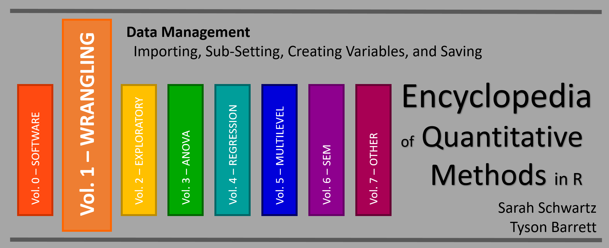

--- 
title: "Encyclopedia of Quantitative Methods in R, vol. 1: Data Wrangling"
author: "Sarah Schwartz & Tyson Barrett"
date: "Last updated: 2021-09-14"
documentclass: book
description: "Data Management: Importing, Subsetting, Creating Variables, and Saving."
knit: "bookdown::render_book"
cover-image: "EQM_v1_cover.png"
github-repo: cehs-research/eBook_wrangle
site: bookdown::bookdown_site
output:
  bookdown::gitbook:
    split_bib: false
bibliography: [book.bib, packages.bib]
biblio-style: "apalike"
link-citations: yes
---


# Welcome {-}

Backgroup and links to other volumes of this encyclopedia may be found at the [Encyclopedia's Home Website](https://cehs-research.github.io/eBooks/).





## Blocked Notes {-}

Thoughout all the eBooks in this encyclopedia, several small secitons will be blocked out in the following ways:

<div class="rmdconstruct">
<p>These blocks denote an area <strong>UNDER CONSTRUCTION</strong>, so check back often. This massive undertaking started during the summer of 2018 and is far from complete. The outline of seven volumes is given above despite any one being complete. Feedback is welcome via either author’s email.</p>
</div>


<div class="rmdimportant">
<p>These blocks denote something <strong>EXTREMELY IMPORTANT</strong>. Do NOT skip these notes as they will be used very sparingly.</p>
</div>


<div class="rmddownload">
<p>These blocks denote something to <strong>DOWNLOAD</strong>. This may include software installations, example datasets, or notebook code files.</p>
</div>


<div class="rmdlightbulb">
<p>These blocks denote something <strong>INTERESTING</strong>. These point out information we found of interest or added value.</p>
</div>


<div class="rmdlink">
<p>These blocks denote <strong>LINKS</strong> to other websites. This may include instructional video clips, articles, or blog posts. We are all about NOT re-creating the wheel. If somebody else has described or illustrated a topic well, we celebrate it!</p>
</div>


## Code and Output {-}

This is how $R$ code is shown:


```r
1 + 1
```

This is what the output of the $R$ code above will look:


```
## [1] 2
```


## The Authors {-}


<table>
 <thead>
  <tr>
   <th style="text-align:center;font-size: 20px;"> Dr. Sarah Schwartz </th>
   <th style="text-align:center;font-size: 20px;"> Dr. Tyson Barrett </th>
  </tr>
 </thead>
<tbody>
  <tr>
   <td style="text-align:center;"> {width=300px} </td>
   <td style="text-align:center;"> {width=300px} </td>
  </tr>
  <tr>
   <td style="text-align:center;"> [www.SarahSchwartzStats.com](http://www.sarahschwartzstats.com/) </td>
   <td style="text-align:center;"> [www.TysonBarrett.com](http://tysonbarrett.com/) </td>
  </tr>
  <tr>
   <td style="text-align:center;"> Sarah.Schwartz@usu.edu </td>
   <td style="text-align:center;"> Tyson.Barrett@usu.edu </td>
  </tr>
  <tr>
   <td style="text-align:center;"> [Statistical Consulting Studio](https://cehs.usu.edu/research/statstudio/index) </td>
   <td style="text-align:center;"> [Data Science and Discover Unit](https://cehs.usu.edu/research/dsdu/index) </td>
  </tr>
  <tr>
   <td style="text-align:center;"> {width=300px} </td>
   <td style="text-align:center;"> {width=300px} </td>
  </tr>
</tbody>
</table>


### Why choose R ?  {-}


<div class="rmdlink">
<p><strong>Check it out:</strong> an article from Fall 2016… <a href="https://datahowler.wordpress.com/2016/09/10/no-more-excuses-r-is-better-than-spss-for-psychology-undergrads-and-students-agree/">No more excuses: R is better than SPSS for psychology undergrads, and students agree</a></p>
</div>


### FYI  {-}

This entire encyclopedia is written in $R Markdown$, using $R Studio$ as the text editor and the `bookdown` package to turn a collection of markdown documents into a coherent whole. The book's source code is hosted on GitHub. If you notice typos or other issues, feel free to email either of the authors.

This work is licensed under the [Attribution-NonCommercial-NoDerivatives 4.0 International](https://creativecommons.org/licenses/by-nc-nd/4.0/legalcode) License. 


{width=300px}
